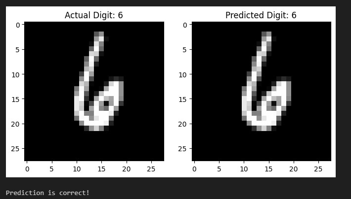
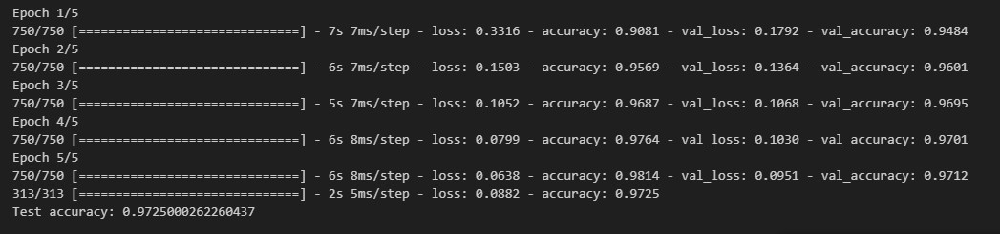

# MNIST Digit Classification Using Neural Networks

## Background

The MNIST dataset is a well-known dataset in the field of machine learning and computer vision. It consists of 70,000 grayscale images of handwritten digits (0-9), with 60,000 images in the training set and 10,000 images in the test set. Each image is 28x28 pixels. The primary task is to classify each image into one of the ten digit classes.

## Objective

The objective of this project is to build and train a neural network model using the Keras library to accurately classify handwritten digits from the MNIST dataset. The model will be evaluated on its accuracy using a separate test dataset.

## Achievements

- **Data Preprocessing:** Loaded and preprocessed the MNIST dataset, including normalization and one-hot encoding of labels.
- **Model Development:** Created a neural network model using Keras, consisting of a Flatten layer and two Dense layers.
- **Model Training:** Trained the neural network model on the training dataset, achieving high accuracy on the validation set.
- **Model Evaluation:** Evaluated the trained model on the test dataset, demonstrating its ability to generalize to unseen data.

## Dataset

The MNIST dataset contains 70,000 images of handwritten digits. Each image is a 28x28 pixel grayscale image, and the dataset is divided into a training set of 60,000 images and a test set of 10,000 images.

## Model Implementation

The neural network model is implemented using the Keras library. The following code demonstrates the model development, training, and evaluation process:

```python
import numpy as np
from keras.datasets import mnist
from keras.models import Sequential
from keras.layers import Dense, Flatten
from keras.utils import to_categorical

# Load the MNIST dataset (handwritten digits)
(train_images, train_labels), (test_images, test_labels) = mnist.load_data()

# Preprocess the data
train_images = train_images.reshape((60000, 28, 28, 1)).astype('float32') / 255
test_images = test_images.reshape((10000, 28, 28, 1)).astype('float32') / 255

train_labels = to_categorical(train_labels)
test_labels = to_categorical(test_labels)

# Create a neural network model
model = Sequential()
model.add(Flatten(input_shape=(28, 28, 1)))
model.add(Dense(128, activation='relu'))
model.add(Dense(10, activation='softmax'))

# Compile the model
model.compile(optimizer='adam', loss='categorical_crossentropy', metrics=['accuracy'])

# Train the model
model.fit(train_images, train_labels, epochs=5, batch_size=64, validation_split=0.2)

# Evaluate the model on the test data
test_loss, test_accuracy = model.evaluate(test_images, test_labels)
print(f"Test accuracy: {test_accuracy}")
```
## Result

The model achieved high accuracy on the test dataset, indicating its effectiveness in classifying handwritten digits. The test accuracy after training the model for 5 epochs is:



## References
Keras Documentation
MNIST Dataset
Numpy Documentation
Sequential Model

This project showcases a simple yet effective approach to digit classification using neural networks, highlighting the capabilities of Keras for building and training deep learning models.